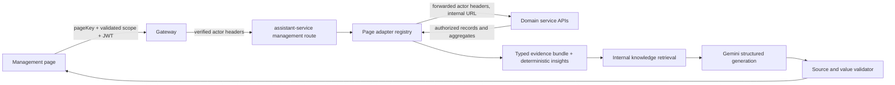

# Design: Management Context Copilot

Generated by /office-hours on 2026-09-09
Branch: microservices
Repo: LushWare-Org/Travel-CRM
Status: DRAFT
Mode: Startup
Supersedes: kevin-microservices-design-20260908-145315.md

## Problem Statement

Management staff arrive on leads, packages, bookings, billing, analytics, users, careers, and settings without the historical context an experienced employee carries. The requested product is a universal, read-only assistant that opens each protected page with an analytical situation briefing and then supports natural-language follow-up questions grounded in the page's real data.

The product is not a generic chatbot. Its job is to make a cold reader understand the page as if they had worked with the agency for years: what is true now, what changed, what is unusual or missing, and what an experienced employee would inspect next.

## Demand Evidence

The user described the observed need as: **"getting an overall analytical view when coming to the page fresh; this tool makes everyone work like they have worked for long time."** Prior approved work also records staff reconstructing leads across WhatsApp, calls, multiple sessions, packages, pricing, and billing documents. No baseline yet measures time-to-understanding, error rate, or onboarding time, so the value thesis is behaviorally plausible but not quantified.

## Status Quo

- Management is an authenticated React app with protected routes for overview, analytics, leads, packages, flights, hotels, billing, users, careers, and organization settings.
- Each page fetches real data through existing gateway-backed domain APIs, but interpretation is manual and fragmented.
- `/leads` is the richest example: the current page and dialogs already combine lead status, remarks, WhatsApp history, package selections, itinerary, pricing, flight bookings, quotations, invoices, receipts, and vouchers.
- A Gemini-backed `assistant-service` already exists for the public Client site. It has a pinned `gemini-3.5-flash` default, JSON-Schema-constrained generation, gateway routing, telemetry, feature flags, and tested provider-failure handling. Its current `/api/v1/assistant/turn` endpoint is public and must not be reused as the Management data boundary.
- `PolicyDocument` is customer-facing policy content used by the public assistant. Internal operating guidance must not be added to that same retrieval surface.

## Target User & Narrowest Wedge

Target users are authenticated sales reps, admins, and super-admins who open a page or record they have not worked on recently. The wedge inside every page is one repeatable interaction:

1. Proactively show a cited **Situation briefing** after the page scope becomes stable.
2. Structure it as **Current state → What changed → Needs attention → Experienced view**.
3. Offer three scope-specific questions plus a free-form ask box for drill-down.
4. Remain read-only. The assistant cannot change status, send messages, edit quotes, book inventory, issue documents, or mutate any record.

The user explicitly chose an all-protected-pages launch rather than a lead-first rollout. Completeness therefore means every registered Management page has a real adapter, failure state, evaluation cases, and role-isolation coverage before launch.

## Constraints

- Extend `assistant-service`, but add a separate authenticated Management route, prompt family, contracts, metrics, flags, and controller. Public and staff behavior must never share a request schema or authorization path.
- Reuse the existing Gemini client and pinned Flash-class model first. No new agent framework, fine-tuning pipeline, vector database, or second model provider without evaluation evidence.
- The model is a language and synthesis layer. It never receives database credentials, writes SQL, chooses arbitrary URLs/endpoints, or requests additional data.
- Page adapters fetch through existing domain-service APIs under the signed-in user's identity. Downstream service authorization remains the source of truth; the assistant cannot broaden access.
- All outputs are read-only and source-backed. Missing or partial evidence produces an explicit unknown/partial state, never a guess.
- CRM free text, communication excerpts, uploaded content, and knowledge articles are untrusted data. They are clearly separated from instructions; model output is schema-validated and rendered as text only. No model-authored HTML or executable links.
- Data sent to Gemini is field-allowlisted and minimized. Passport data, credentials, payment instruments, bank details, authentication data, and unrelated contact fields are always excluded. Raw prompt/context/response bodies are never logged.
- Production enablement is blocked until the agency approves the Gemini data-processing and retention terms for the allowed Management fields.
- The underlying page remains fully usable while the briefing loads, when a source is unavailable, when Gemini times out, or when quota is exhausted.
- The panel follows `Management/DESIGN.md`: token-only colors, one teal interactive accent, semantic status colors, Archivo/Public Sans/JetBrains Mono, 12px minimum readable text, 6–8px normal radii, both themes, no gradients, avatars, or chat bubbles.

## Premises

1. The primary experience is a proactive page briefing; natural-language chat is drill-down, not an empty starting state.
2. All protected Management pages launch together, but only through explicit read-only adapters. No arbitrary database or API access exists.
3. The assistant may access only data the current user can already access, including existing sales-rep ownership restrictions and admin-only pages.
4. Every claim names its evidence type: current record fact, computed metric, historical pattern, approved internal guidance, or labeled inference. Source and freshness are visible.
5. The durable asset is the agency's typed context, permissions, evaluations, and reviewed knowledge. Gemini is replaceable behind the existing generation seam.
6. Success is faster, more consistent cold-start understanding, not conversation volume.

## Current Practice Check

- Microsoft documents the correct access boundary: organizational grounding is scoped to the signed-in user's existing permissions, not tenant-wide visibility: https://learn.microsoft.com/en-us/microsoft-365/copilot/microsoft-365-copilot-architecture
- Salesforce's first-party CRM action catalogue emphasizes record summaries, activity timelines, related interactions, similar records, next-step suggestions, and reports. Its release notes also support context by current page type and record: https://help.salesforce.com/s/articleView?id=ai.copilot_actions_ref.htm&language=en_US&type=5
- OWASP states that retrieval and fine-tuning do not eliminate prompt injection. It recommends least privilege, strict output formats, source citations, deterministic validation, segregated untrusted content, and human approval for risky operations: https://genai.owasp.org/llmrisk/llm01-prompt-injection/

The conventional pattern is sound here. The project-specific insight is interface-level: **the page should brief the operator before the operator has to prompt it.**

## Approaches Considered

- **Approach A — Screen Snapshot Copilot, minimal, rejected:** fastest all-page UI by sending already-loaded browser JSON, but only 6/10 complete because facts are client-tamperable, related history is incomplete, and provenance is weak.
- **Approach B — Server-Grounded Page Adapter Registry, chosen:** authenticated page descriptors select allowlisted server adapters that build typed evidence under the caller's existing permissions; Gemini produces cited structured briefings and answers.
- **Approach C — Institutional Memory Index, deferred:** a continuously updated cross-service read model would improve scale and historical similarity later, but adds synchronization, deletion, retention, backfill, and embedding-access failure modes before usage justifies them.

## Recommended Approach

### 1. Product behavior

Mount one `ManagementContextCopilot` shell beside the protected route outlet. Each page registers a `pageKey` and a validated scope descriptor, never page data. Once the page's filters or record selection are stable, the shell requests a briefing automatically.

The desktop panel is docked on the right and collapsible. It does not cover the current page. On narrow screens it becomes an explicit full-height drawer and never opens automatically over the workflow. The panel shows:

1. A deterministic context stamp: page/record scope, active filters, caller role, and `asOf` time.
2. Current state.
3. What changed for `since=last_visit|today|7_days`.
4. Needs attention, ordered by deadline and operational risk.
5. Experienced view, visible by default on desktop.
6. Inline source tags and a read-only evidence peek.
7. Three questions derived from unresolved attention items and a scope-named ask field, such as `Ask about LEAD-8F21A9D0…`.

Answers append as cited resolution blocks, not speech bubbles. Focusing a source tag highlights the corresponding page field or row when that target is currently rendered. Evidence that is not on screen opens in the read-only evidence drawer.

Approved wireframe: `gstack-sketch.lU45K5/sketch.png` (private office-hours artifact).

### 2. Service boundary and request flow



Add `POST /api/v1/assistant/management/turn`. It is intentionally absent from `PUBLIC_PATTERNS`, so the gateway verifies the JWT before the billed model path. `assistant-service` also applies its local `extractUser`/`requireAuth` equivalent and rejects requests without gateway-provided actor context.

Adapters fetch through each domain service's internal URL (the existing `*_SERVICE_URL` convention), forwarding the same gateway-verified `x-user-*` actor headers this service already received. They never re-present the bearer token back through the gateway and never mint `x-internal-token`. This preserves each domain service's existing ownership/role checks without a server-to-self ingress hop or interaction with the gateway's public rate limiters. Two identity conventions exist and must not be conflated: `x-internal-token` is a service key for service-acted actions (e.g. lead-service snapshotting a quotation in billing-service); `x-user-*` is the forwarded end-user context that domain `extractUser` middleware already trusts. Extending that trust to assistant-service requires granting its Cloud Run service account `run.invoker` on the domain services, mirroring how the gateway is the sole invoker today. Domain services remain `allow_unauthenticated=false`; nothing about their public posture changes.

### 3. Shared request contract

Add a versioned Zod contract in `@travel-crm/contracts`:

```ts
type PriorClaim = {
  text: string;
  facts: Array<{ kind: BriefingFact['kind']; value: string }>;  // no evidenceId: turn-local by design
};

type ManagementAssistantTurnRequest = {
  mode: 'deterministic' | 'briefing' | 'ask';
  page: {
    key: 'overview' | 'analytics' | 'leads' | 'packages' | 'flights' | 'hotels' | 'billing' | 'users' | 'career' | 'settings';
    scope: PageScope;          // discriminated union owned by that page key
    since: 'last_visit' | 'today' | '7_days';
    lastSeenAt?: string;       // display hint; the authoritative value is server-side
  };
  messages?: Array<{ role: 'user' | 'assistant'; content: string }>;
  priorClaims?: PriorClaim[];
};
```

Rules:

- `mode='deterministic'` runs `loadEvidence` + `computeInsights` only (no Gemini) and returns the context stamp and `deterministicInsights` fast; `mode='briefing'` adds the model claims; `mode='ask'` answers a follow-up. The deterministic response renders first and the model response appends claims.
- `messages` is required only for `mode='ask'`, capped at the latest 10 turns and 8,000 total characters.
- The server discards any assistant message fields outside plain text.
- Every `page.key` has a distinct scope schema. Unknown filters, record kinds, IDs, sort fields, and page keys fail with `400` before data fetch or model use.
- The page key and scope change resets the client conversation. Institutional memory comes from current records and reviewed knowledge, not persisted chat transcripts.
- Each `mode='ask'` turn re-fetches the current evidence bundle for the stable scope. Grounding validation always runs against this turn's fresh bundle; a prior turn's `evidenceId`s are never treated as valid citations in a later turn.
- `priorClaims` is client-asserted conversation continuity only and is serialized into the untrusted-data section with no acceptance authority. It carries this session's prior claims as `text` plus evidenceId-free `facts` (up to 10) so the model can answer follow-ups like "you said invoice X was overdue — expand" without re-deriving. It can never alter the page key, scope, evidence IDs, output schema, or source targets, and it never satisfies grounding for a new claim.

### 4. Adapter registry

Create a single registry in `assistant-service`. Every adapter implements the same deep interface:

```ts
interface ManagementPageAdapter<S> {
  key: 'overview' | 'analytics' | 'leads' | 'packages' | 'flights' | 'hotels' | 'billing' | 'users' | 'career' | 'settings';
  parseScope(input: unknown): S;
  loadEvidence(ctx: ActorContext, scope: S): Promise<EvidenceBundle>;
  computeInsights(bundle: EvidenceBundle, since: Date): DeterministicInsight[];
  defaultQuestions(bundle: EvidenceBundle): string[];
}
```

`loadEvidence` may return a partial bundle with named failed sources. One dependency failure must not erase successful evidence from other services. Each adapter sets explicit record, byte, and excerpt limits before model use.
The three suggested questions have exactly one producer: `defaultQuestions(bundle)`, seeded from the adapter's deterministic attention items. The model never authors questions; the `suggestedQuestions` field in the result is populated server-side from this adapter output. If an adapter returns fewer than three, the client renders only what it returned and never invents the rest.

| Page key | Valid scope | Authoritative grounding | Required cold-start output |
|---|---|---|---|
| `overview` | current actor | role-scoped dashboard, lead stats, relevant analytics | workload, movement, deadlines, anomalies, missing signals |
| `analytics` | selected tab + allowlisted time range | existing analytics endpoints and metric definitions | headline movement, denominator/sample size, anomalies, caveats |
| `leads` | collection filters or one lead ID | lead service plus authorized related package, flight, communication, and billing reads | state, timeline delta, gaps, deadlines, guidance |
| `packages` | collection filters or package ID | package-service persisted package/itinerary/pricing records | publish/readiness state, changes, incomplete content, performance context |
| `flights` | booking filters/ID or allowlisted selected-offer references | flight-service persisted bookings; selected live offers must be revalidated server-side | booking state, expiry/change risk, missing traveler/segment data |
| `hotels` | booking filters/ID or allowlisted selected-hotel references | hotel-service persisted bookings; selected live results must be revalidated server-side | booking state, cancellation/price facts, missing guest/stay data |
| `billing` | document filters or quotation/invoice/receipt/voucher ID | billing-service documents and server-computed totals | document chain, due/paid state, discrepancies, required follow-up |
| `users` | allowlisted filters or user ID | user-service records already available to the admin caller | role/status overview, access anomalies, incomplete account state |
| `career` | allowlisted filters or application/vacancy ID | career-service structured records | pipeline state, deadlines, missing review data; attachment bodies excluded |
| `settings` | organization scope | user-service organization settings and internal knowledge metadata | completeness, stale guidance, policy ownership; secret bank/auth fields excluded |

Search result pages need special handling. Browser-provided result bodies are never trusted as facts. The client sends only allowlisted result references; the adapter revalidates or hydrates a bounded selection through the owning service. If no safe hydration endpoint exists, that result type is reported as unavailable rather than falling back to the browser snapshot.

### 5. Evidence and output contracts

Adapters return a canonical bundle:

```ts
type EvidenceItem = {
  id: string;                  // server-generated, turn-local
  type: 'record' | 'computed' | 'pattern' | 'guidance';
  label: string;
  value: unknown;              // allowlisted structured value
  recordRef?: { kind: string; id: string };
  fieldPaths?: string[];
  updatedAt?: string;
  asOf: string;
};
type DeterministicInsight = {
  id: string;
  section: 'current_state' | 'changed' | 'attention' | 'experienced_view';
  severity: 'info' | 'warning' | 'critical';
  text: string;                 // adapter-authored, template-filled; no model prose
  fact?: BriefingFact;          // optional typed value, already grounded by the adapter
  evidenceIds: string[];        // adapter-authored, must exist in the bundle
};

type EvidenceBundle = {
  context: { pageKey: string; scopeLabel: string; actorRole: string; asOf: string };
  evidence: EvidenceItem[];
  deterministicInsights: DeterministicInsight[];
  unavailableSources: string[];     // dependency outage/timeout; page usable without these
  notAuthorizedSources: string[];   // 403/404 for records the caller may not access
};

```

Gemini returns JSON only. Free prose is reserved for qualitative synthesis. Any value an operator might act on — an ID, date, currency amount, percentage, count, or duration — must be emitted as a typed fact, never embedded in prose:

```ts
type BriefingFact = {
  kind: 'id' | 'date' | 'amount' | 'percentage' | 'count' | 'duration';
  value: string;              // normalized canonical form
  evidenceId: string;         // must exist in the current bundle
};

type BriefingClaim = {
  id: string;
  section: 'current_state' | 'changed' | 'attention' | 'experienced_view';
  text: string;               // qualitative prose only; no numbers, dates, or IDs
  facts: BriefingFact[];      // the only place risky values appear
  evidenceIds: string[];      // superset of facts' evidenceId
  evidenceType: 'record' | 'computed' | 'pattern' | 'guidance' | 'inference';
  severity: 'info' | 'warning' | 'critical';
};

type ManagementAssistantTurnResult = {
  context: { pageKey: string; scopeLabel: string; generatedAt: string; partial: boolean; noAccess: boolean };
  claims: BriefingClaim[];
  answerBlocks?: BriefingClaim[];
  suggestedQuestions: string[];   // server-computed, never model-authored
  sources: Array<{ id: string; label: string; type: string; updatedAt?: string; target?: SourceTarget }>;
  unavailableSources: string[];
  notAuthorizedSources: string[];
};
```

Post-generation validation is load-bearing and fully deterministic — no model judgment anywhere in the pipeline:

- **Schema.** The JSON is parsed against the Zod schema. Unknown keys, unknown sections, or a `fact` with an unknown `kind` reject the whole result; the controller falls back to the deterministic stamp.
- **Evidence existence.** Every `evidenceId` in `claims` and in every `fact` must exist in the current bundle. Unknown IDs reject the claim or drop the fact.
- **Fact grounding.** Each `fact` is matched against its cited evidence item by `kind`: `id` against record IDs, `date` against ISO timestamps (calendar-day equivalence), `amount` against numeric currency values (canonicalized to a decimal with currency symbol and thousands separators normalized), `percentage` against ratio fields within rounding tolerance, `count` against integer fields, `duration` against interval fields normalized to one unit. A non-matching fact is dropped.
- **Claim pruning.** A claim whose facts and evidence are all dropped is removed. A claim whose `text` still contains a token shaped like a number, date, or ID after fact extraction is rejected — the model is instructed never to place such values in prose, so any residual token is an unsupported claim and is discarded.
- **Sources.** `sources` is constructed by the server from accepted `evidenceId`s, never from model-authored labels or URLs.
- **Fallback.** If no model claims survive, each `DeterministicInsight` is converted to a `BriefingClaim` (same `section`/`severity`/`text`, its `fact` moved into `facts`, `evidenceType` set to the insight's source type, `evidenceIds` kept) and returned with a partial-warning state rather than fabricated prose. This makes fallback, partial, and provider-failure states render through the same single `claims` contract the client and the evaluation corpus already assert.
- **Inference.** Inference may explain relationships among cited facts but cannot introduce a new number, policy, promise, availability statement, or required action.
- **Guidance gating.** While `MANAGEMENT_COPILOT_GUIDANCE_ENABLED` is `false`, any claim with `evidenceType='guidance'` is rejected during validation — not merely hidden — so staff-only SOP content is never sent to the model or rendered. When enabled, guidance claims are validated exactly like record/computed/pattern claims.
- **Rendering.** The client renders plain text plus server-resolved facts and source targets only.

### 6. Institutional knowledge

Create a separate internal `ManagementKnowledgeArticle` store owned by user-service. Do not place staff-only SOPs in the existing customer-facing `PolicyDocument` corpus.

Minimum fields: `id`, `title`, `body`, `category`, `pageKeys[]`, `status`, `validFrom`, `validUntil?`, `updatedAt`, `updatedById`. Admin/super-admin can create and publish articles from an **AI Knowledge** section in Organization Settings; authenticated staff can read published excerpts only through the Management assistant.
The copilot's `guidance` claim type is gated behind its own flag, `MANAGEMENT_COPILOT_GUIDANCE_ENABLED` (default `false`), separate from the main copilot flag. Record, computed, and pattern claims ship and pass acceptance first; the article store, admin CRUD, published-read endpoint, and the **AI Knowledge** settings section are built only when guidance is enabled. The reason it is bundled here at all: premise 5 (reviewed company guidance is the durable asset) — but it is a separable release and must not block the all-page launch.

Reuse the lexical retrieval/scoring logic already extracted into `@travel-crm/policy-retrieval`, but use a separate fetch function and corpus. At the expected document count, lexical retrieval is enough. Reconsider semantic embeddings only after more than 500 active articles or measured retrieval misses justify them.

Historical comparisons are computed by domain/analytics services with explicit window, cohort, and sample size. Gemini never counts records or calculates medians from raw arrays. A comparison with an insufficient sample is omitted.

### 7. Model policy

- Default: existing pinned `gemini-3.5-flash` through `generateStructured`.
- `temperature=0.2`, bounded output, one attempt inside a 17-second server deadline; Management uses a 20-second endpoint-specific client timeout with automatic retry disabled.
- Prompt versions are separate: `managementBriefing.v1` and `managementAnswer.v1`.
- System instructions define the read-only role and evidence rules. CRM text and knowledge excerpts are serialized in a distinct untrusted-data section.
- `briefing` mode uses a single adapter-fetch + one structured generation, no tool loop. `ask` mode uses a **bounded tool loop**: the model selects from a fixed, allowlisted domain-tool enum (`getLead`, `getLeadActivity`, `getMatchingPackages`, `getSalesMetrics`, `getSimilarConvertedLeads`, `searchManagementKnowledge`), the server executes each tool under the caller's `x-user-*` identity and returns bounded, allowlisted results, and the loop is hard-capped at four calls. This reuses the existing `assistantTurn`/`wizard-turn` tool-calling convention — fixed enum, server-executed, Zod-validated, canonicalized — rather than a new agent framework.
- The Gemini generation schema is **flat**, with `section` as a discriminated-union key and no conditional/empty-object fields; raw output is canonicalized server-side into the strict per-claim union before validation. This mirrors the documented `assistantTurn` boundary (`assistantTurn.v1.js`), which flat-canonicalizes because conditional/empty-object schemas returned `args: {}` in live structured-output calls.
- Model routing (Flash for summaries, a higher-reasoning model for complex cross-region analytics questions) is deferred until the Flash model fails the expert rubric; it is a later optimization, not v1.

### 8. Privacy, security, and logging

- Authorization denial is a distinct outcome from a dependency outage. A downstream `403`/`404` on a record the caller may not access is recorded in `notAuthorizedSources`, never folded into `unavailableSources`. Denied sources are omitted from the evidence bundle entirely and from any sibling claim's grounding.
- When the scope's principal record is denied, the response is a no-data state (`context.noAccess=true`) with no claims over that record — the panel shows an explicit "you do not have access" message, not a partial inference over sibling records. Denial is determined by the downstream domain service's own `403`/`404` and ownership scoping, never by a pre-check in the adapter. This matters because the ownership model has carve-outs: lead-service lets any salesRep open an unclaimed `PENDING_VERIFICATION` lead, so an adapter that pre-checks `assignedToId` would wrongly noAccess the unclaimed queue — the exact cold-start case this tool targets. Adapters must propagate the domain service's decision verbatim.
- Every evaluation case asserts the denial path: the same denial surfaces through the assistant as through the source domain API, and no surviving claim cites a denied source.
- Reuse the gateway's verified identity propagation and domain authorization. Test direct assistant-service access without actor context as `401`.
- The Management route's trust in `x-user-*` headers holds only because assistant-service is deployed gateway-only-internal (`allow_unauthenticated=false`, the gateway's service account is the sole `run.invoker`) — the same posture as the domain services, despite assistant-service also serving the public `/assistant/turn`. A caller who could reach assistant-service directly would be able to forge `x-user-*`; this is a deployment invariant that must be stated and preserved, not assumed.
- Field allowlists live beside each adapter. Blacklist-only redaction is not accepted.
- Communication excerpts are bounded and pass secret/payment/passport redaction before the model call. Attachments, resumes, HTML, binary files, and external URLs are excluded in this release.
- Treat remarks, messages, package descriptions, and knowledge bodies as indirect prompt-injection inputs. They cannot alter page key, scope, evidence IDs, output schema, or source targets.
- No Management prompt, message, evidence value, customer identifier, record identifier, or generated prose is written to application logs or analytics events.
- Telemetry stores only page key, scope kind, actor role, context fingerprint hash, model/prompt version, latency, source count, partial-source count, result category, and feedback enums.
- Rate limiting is per authenticated actor, separate from the public visitor assistant quota. Return `429` distinctly from provider failure.

### 9. Client state and failure behavior

- Generate only after the page declares its scope ready and remains stable for 300ms. Abort the prior request when route, filters, selected record, or dialog scope changes.
- Render in two phases: the `mode='deterministic'` response (stamp + deterministic insights) paints immediately, then the `mode='briefing'` response appends model claims. The skeleton only covers the model phase, never the deterministic phase.
- Cache the accepted result in memory for the current browser session by `{actorIdHash,pageKey,scopeFingerprint,since}`. The cache is bounded by a hard 60-second TTL plus invalidation on any successful page mutation the client observes. Cross-operator or cross-route writes are not observable client-side, so a briefing labeled "current state" may be up to 60 seconds stale; it is never presented as fresher than its `asOf` stamp. Correct cross-operator eviction is deferred to v2 persistent snapshots.
- Loading uses a skeleton inside the dock; it never blocks or dims the page.
- Partial source failure shows the surviving claims and names unavailable source categories; a denied source shows an explicit no-access message, never a silent gap.
- Provider failure keeps deterministic context facts and the manual page intact, with a retry button.
- `lastSeenAt` is authoritative and stored server-side per `{actor, pageKey, scopeFingerprint}` — the same value surfaced as the `asOf` stamp. The server writes it after each successful briefing and uses it to compute the `last_visit` delta. The client may send a `lastSeenAt` hint for display, but it never overrides the server value, so a cold reader on a new device or after clearing storage still gets the correct delta. On a genuine first visit (no server record), `since=last_visit` degrades to `7_days` and the panel labels the window "no prior visit — showing 7 days".
- No chat transcript is persisted server-side; the only server-side client state is `lastSeenAt`, stored as a Prisma table in assistant-service (not in-memory, so it is consistent across Cloud Run instances). The latest 10 turns live in component state and reset on scope change.

### 10. Measurement and evaluation

Add separate Management assistant events and feedback; do not reuse anonymous visitor metrics. Required events: `briefing_requested`, `briefing_completed`, `briefing_failed`, `source_opened`, `question_asked`, `answer_completed`, `answer_failed`, `helpful`, and `needs_correction`. Correction reasons are enums (`missing_source`, `stale_source`, `wrong_fact`, `wrong_interpretation`, `bad_guidance`, `other`) with no free-text in the first release.

Build an expert-reviewed evaluation corpus with six sanitized scenarios for each of the ten route/page areas: normal, empty, partial dependency, stale data, attention-worthy, and unauthorized. Each case contains the canonical evidence bundle, expected facts/attention items, allowed source IDs, forbidden claims, and the veteran explanation. Two additional cross-cutting cases per area cover multi-turn drill-down (a follow-up referencing a prior claim stays grounded) and first-visit `last_visit` degradation. Structural contract tests run in CI and must include a deterministic grounding-validator suite: for each `kind`, a supported fact passes, a mismatched fact is dropped, a prose-embedded value is rejected, and a denied/unknown evidence ID rejects the claim. A live Gemini replay runs manually before enablement, three times per case to expose stochastic failures; it is not put in normal CI because the current quota is 5 requests per minute.

Feature flags:

- `MANAGEMENT_COPILOT_ENABLED`, default `false`.
- `MANAGEMENT_COPILOT_PAGE_KEYS`, an allowlist for page-specific rollback. All ten keys must pass their acceptance suite before the user-selected all-page launch enables them together.
- `MANAGEMENT_COPILOT_GUIDANCE_ENABLED`, default `false`, gates the guidance claim type and its article store/CMS independently of the main launch.

## Open Questions

No unresolved product decision blocks implementation. Engineering review must map each adapter to exact existing endpoints and identify the few net-new read endpoints required for revalidating live flight/hotel selections and record-level historical comparisons; it must not silently fall back to client snapshots.

## Success Criteria

- **Access:** 100% of cross-role and cross-owner tests return the same denial through the assistant as through the source domain API; zero data from inaccessible records enters an evidence bundle.
- **Grounding:** 100% of rendered claims have valid turn-local sources; zero unsupported IDs, dates, prices, percentages, counts, or durations survive validation.
- **Expert quality:** across the full live corpus (six base plus two cross-cutting scenarios per page area), factual precision is at least 95%, attention-item recall is at least 90%, and no forbidden policy, price, availability, personnel, or financial claim appears in any of three runs per case.
- **Coverage:** all ten protected route/page areas pass normal, empty, partial, stale, unauthorized, and provider-failure behavior before the all-page feature flag is enabled.
- **Speed:** deterministic context appears within 1 second after scope stability; full briefing p95 is at most 12 seconds. The page remains interactive throughout.
- **User outcome:** in the assignment pilot, median time for a cold staff member to produce the veteran rubric falls by at least 50%, with at least 80% rubric completeness and no increase in operational corrections.
- **Adoption quality:** at least 70% of rated briefings are marked helpful, fewer than 10% are marked needs-correction, and source-open behavior confirms staff verify consequential claims rather than accepting unsupported prose.

## Reviewer Concerns

The adversarial review loop reached its three-iteration cap with the following unresolved issues (dimension in parentheses). Downstream engineering review must resolve these before implementation:

1. **(Consistency) Fallback conversion vs. claim contract.** Converting `DeterministicInsight` to `BriefingClaim` reuses a text field that the pruning rules treat as number-free prose, and can duplicate the already-rendered deterministic phase; in `ask` mode it may surface insights the user did not ask for. Resolution: exempt server-authored fallback claims from residual-token pruning and the qualitative-text rule, restrict fallback to `briefing` mode (an `ask` fallback returns an explicit cannot-verify state), and state how `evidenceType` is derived per insight.
2. **(Feasibility) Cross-operator cache eviction transport.** The client holds an in-memory cache in a request/response design with no channel to learn of another operator's or another route's writes. Resolution: either introduce a server-side cache subscribed to write events, or drop the cross-operator clause and rely on the 60-second TTL alone; also define which phase commits `lastSeenAt` (cache-hit refresh currently conflicts with write-after-successful-briefing).
3. **(Completeness) Deterministic response contract undefined.** The `mode='deterministic'` wire response matches neither `EvidenceBundle` nor `ManagementAssistantTurnResult`, and phase-1 `noAccess`/`partial`/`unavailable` fields plus the client rule to skip the briefing call after a denial are unspecified. Resolution: define an explicit deterministic-result contract and the client noAccess/partial handling; clarify `ask`-mode `claims` vs `answerBlocks`.
4. **(Consistency) Settings adapter vs. guidance gating.** The `settings` row grounds on internal knowledge metadata and promises stale-guidance/policy-ownership outputs, but the article store is deferred until `MANAGEMENT_COPILOT_GUIDANCE_ENABLED`. Resolution: specify pre-guidance `settings` behavior (knowledge outputs empty/unavailable) and mark that row's knowledge columns as guidance-gated.
5. **(Consistency) Fact grounding ignores `fieldPaths`.** Matching a `kind` against any value in a composite evidence item lets a misattributed amount/count validate; `fieldPaths` is currently unused by the validator. Resolution: make grounding field-scoped via `fieldPaths` (or one scalar per evidence item) and define per-field canonicalization.
6. **(Feasibility) Deterministic latency has no budget.** The 1-second deterministic target has no deadline or per-adapter load budget, while the only stated limits (17s/20s) govern the model path, and `loadEvidence` runs twice per cold open. Resolution: give the deterministic endpoint its own deadline and load budget (or reuse evidence server-side across the two phases), and gate the speed criterion on a measured p95.
7. **(Clarity) Residual-token rejection misses spelled/relative values.** The zero-unsupported-values grounding criterion over-rejects legitimate numeric prose while missing spelled quantities and relative dates ("tomorrow", "three days", "five hundred dollars"). Resolution: add bounded normalization for relative dates/times and spelled quantity/currency phrases, or reword the criterion to "typed facts plus token-shaped prose".

## Dependencies

- Existing `assistant-service`, `generateStructured`, gateway proxy/auth, Cloud Run deployment, and shared contracts package.
- Cloud Run IAM change: grant assistant-service's service account `run.invoker` on the domain services it reads from, and add each domain service's internal URL to assistant-service's environment.
- A small actor-scoped `lastSeenAt` key-value store in assistant-service (the only server-side client state beyond the existing service).
- Existing domain APIs and authorization rules; net-new bounded read endpoints where no safe hydration exists.
- New internal Management knowledge model, admin CRUD, published-read endpoint, and initial reviewed SOP content — gated behind `MANAGEMENT_COPILOT_GUIDANCE_ENABLED`.
- Agency approval of Gemini processing/retention for the explicit Management field allowlists.
- Existing deployment workflow covers the service, shared contracts, Management build, Prisma migrations, and Cloud Run rollout; no new distribution channel is needed.

## The Assignment

Observe three staff members opening Management pages they did not work on recently. Do not explain the page. Time how long each person takes to state: current situation, what changed, risks, missing information, and the next thing an experienced employee would inspect. Record the exact source fields they used and ask a veteran to write the expected answer. Those observations become the first evaluation cases and the baseline for the 50% time-to-understanding target.

## What I Noticed

- You rejected a lead-only rollout and chose **"all pages, read-only"**. That is a broad launch, but the read-only boundary removes the most dangerous class of failure without weakening the institutional-memory goal.
- Your phrase **"makes everyone work like they have worked for long time"** changed the product. The right opening state is a shift handover with evidence, not a blank assistant waiting for a clever prompt.
- You chose mixed knowledge: live records, historical patterns, and reviewed company guidance. That is the reason this can compound with the agency instead of becoming a replaceable wrapper around Gemini.
- You kept the existing `assistant-service` but accepted a separate authenticated Management contract. Reuse is valuable here only because the public and staff trust boundaries remain explicit.

## GSTACK REVIEW REPORT

| Review | Trigger | Why | Runs | Status | Findings |
|--------|---------|-----|------|--------|----------|
| Eng Review | `/plan-eng-review` | Architecture & tests (required) | 1 | CLEAR | 4 architecture decisions resolved; 3 of 7 adversarial concerns closed |

**VERDICT:** ENG CLEARED — architecture locked, ready to implement.

### Architecture decisions (resolved this review)

1. **Hybrid data path.** `briefing` mode stays deterministic (adapter fetch + one structured generation); `ask` mode gains a bounded tool loop (fixed allowlisted tool enum, server-executed under the caller's identity, hard cap of four calls) reusing the existing `assistantTurn`/`wizard-turn` tool-calling convention. Rejected a full agentic loop for v1 as non-deterministic and quota-expensive; rejected single-shot-only because it cannot answer open-ended cross-entity questions.
2. **Flat + canonicalize schema.** The Gemini-facing generation schema is flat with `section` as a discriminated-union key and no conditional/empty-object fields; raw output is canonicalized server-side before strict validation. This mirrors `assistantTurn.v1.js`, which documents that conditional/empty-object schemas return `args: {}` in live calls.
3. **TTL cache for v1, snapshots deferred.** Keep the 60-second in-memory TTL + client-observed mutation invalidation. Persistent event-driven `AIEntityInsight` snapshots (the external review's optimization, and the correct fix for cross-operator eviction) are deferred to v2 on a usage-volume trigger.
4. **Two-phase JSON, no SSE.** Deterministic phase renders <1s, model claims append; matches the repo's existing non-streaming pattern.

### What already exists (reused, not rebuilt)

- `assistant-service` Gemini seam (`generateStructured`), retry/timeout, provider abstraction.
- `assistantTurn.v1.js` tool-calling resolver + `canonicalizeAssistantTurnResponse` + flat-schema boundary.
- `@travel-crm/policy-retrieval` lexical retrieval (reused for the separate internal knowledge corpus).
- Gateway `x-user-*` identity propagation and per-domain authorization (the AI's permission ceiling).
- Telemetry, feature flags, per-actor rate limiting, Cloud Run deploy + `migrate-all`.

### NOT in scope (deferred, with rationale)

- **Persistent AI insight snapshots** — v2 on usage volume; v1 TTL is correctness-sufficient.
- **Model routing** (Flash vs higher-reasoning) — defer until Flash fails the expert rubric.
- **SSE streaming** — two-phase JSON is enough for v1 perceived latency.
- **Mutating actions** (create follow-up, send message, draft quotation) with confirm-before-mutate — read-only v1; the action-confirmation ladder is the v2 boundary.
- **Semantic embeddings** for knowledge retrieval — lexical is enough below ~500 articles.

### Failure modes (and coverage)

- **Tool-arg injection / cross-tenant fetch** — model-decided tool args (e.g. `leadId`) are Zod-validated and allowlisted, and every tool executes under the caller's `x-user-*` identity; a crafted `leadId` cannot reach another tenant's record. Covered by the denial-path eval cases and the existing canonicalization boundary.
- **`args: {}` from conditional schemas** — avoided by the flat + canonicalize decision.
- **Cross-operator staleness** — bounded at 60s by TTL; accepted for v1, eliminated by v2 snapshots.
- **Provider timeout mid-briefing** — fallback renders deterministic insights via the claim-conversion path; the page stays interactive.

### Parallelization

| Lane | Workstream | Depends on |
|------|-----------|------------|
| A | `assistant-service` (route, controller, registry, adapters, tool-loop, validator) | frozen contracts |
| B | `@travel-crm/contracts` (Zod request/result schemas) | — |
| C | `Management` client (copilot panel + per-page scope registration) | B |
| D | `user-service` internal knowledge store + admin CRUD | gated behind `MANAGEMENT_COPILOT_GUIDANCE_ENABLED` |

Freeze B first (the contract A implements and C consumes), then launch A + C + D in parallel worktrees. A and C share the contract, not files, so no merge conflict; D is fully independent.

### Implementation Tasks

- [ ] **T1 (P1, human: ~3h / CC: ~20min)** — `@travel-crm/contracts` — freeze flat Zod request/result schemas (`ManagementAssistantTurnRequest` with `mode: deterministic|briefing|ask`, flat `BriefingClaim`, deterministic-result contract).
  - Surfaced by: Architecture D2 — flat + canonicalize; adversarial concern #3 (deterministic response contract undefined).
  - Files: `Services/shared/contracts/src/`
  - Verify: `npm test` in contracts; schema accepts a canonical flat response and rejects conditional/empty shapes.
- [ ] **T2 (P1, human: ~6h / CC: ~30min)** — `assistant-service` — Management route + controller + page-adapter registry + deterministic `computeInsights` + flat canonicalization + grounding validator.
  - Surfaced by: Architecture D1/D2; adversarial concerns #1, #5 (fieldPaths-scoped grounding), #7 (relative/spelled value normalization).
  - Files: `Services/assistant-service/src/{routes,controllers,adapters,ai}`
  - Verify: validator CI suite — per-`kind` supported/mismatched/prose-embedded/denied-ID cases.
- [ ] **T3 (P1, human: ~5h / CC: ~25min)** — `assistant-service` — bounded tool loop for `ask` mode (tool enum, `getLead`/`getLeadActivity`/`getMatchingPackages`/`getSalesMetrics`/`getSimilarConvertedLeads`/`searchManagementKnowledge`), each server-executed under caller identity, cap 4.
  - Surfaced by: Architecture D1 — hybrid; learning `assistant_tool_contract_cross_layer` (atomic cross-layer cutover).
  - Files: `Services/assistant-service/src/{tools,toolRegistry,agentRunner}`
  - Verify: tool-arg injection/denial eval cases; no cross-tenant fetch.
- [ ] **T4 (P1, human: ~4h / CC: ~20min)** — `Management` client — `ManagementContextCopilot` shell + per-page scope registration + two-phase render + source-tag focus.
  - Surfaced by: Architecture D4 — two-phase JSON.
  - Files: `Management/src/`
  - Verify: page mutation invalidates cache; denial shows explicit no-access; skeleton only on model phase.
- [ ] **T5 (P2, human: ~2h / CC: ~10min)** — `assistant-service` — `lastSeenAt` Prisma table (cross-instance) + deterministic endpoint deadline (~1s) and per-adapter load budget; reuse the evidence load across the deterministic and briefing phases to avoid a double fetch.
  - Surfaced by: Adversarial concerns #2, #6; outside voice #6, #7.
  - Files: `Services/assistant-service/src/`, `Services/assistant-service/prisma/`
  - Verify: deterministic p95 < 1s measured; first-visit degrades to 7_days; lastSeenAt consistent across instances.
- [ ] **T7 (P1, human: ~4h / CC: ~15min)** — domain services — endpoint audit: map every adapter's grounding to an existing endpoint, and add the net-new read endpoints for flight/hotel live-selection revalidation, record-level historical comparison, and the ask-mode tool sources (`getSimilarConvertedLeads`, `getSalesMetrics`). Confirm each cross-service read by `leadId` re-applies ownership downstream, or is gated by the leads-service ownership decision first.
  - Surfaced by: Outside voice #2, #4; design "Open Questions".
  - Files: `Services/{flight,hotel,analytics,lead,booking}-service/src/`
  - Verify: every adapter's `loadEvidence` resolves to a named endpoint; no silent browser-snapshot fallback; cross-tenant fetch denied in eval cases.
- [ ] **T6 (P3, deferred)** — `user-service` — `ManagementKnowledgeArticle` store + admin CRUD + published-read endpoint (gated).
  - Surfaced by: Adversarial concern #4 (settings adapter vs guidance gating).
  - Files: `Services/user-service/`

_No new tasks from Code Quality (reuse is the DRY strategy)._

NO UNRESOLVED DECISIONS
